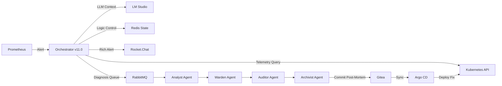

# 📸 Snapshot & Guia de Restauração - Projeto Digital Twin (v11.0)

Este documento é o **Ponto de Restauração (Snapshot)** completo de todo o ecossistema construído. Ele contém as URLs, as credenciais, a lógica dos agentes e as instruções passo-a-passo para recriar todo este laboratório do zero em um Host Linux limpo.

---

## 🏗️ Arquitetura do Sistema (The AI-Ops Pipeline)



---

## 🔗 Mapa de Conectividade e URLs

| Componente | Acesso Local (Host) | Endpoint Interno (K8s) | Finalidade |
| :--- | :--- | :--- | :--- |
| **Gitea** | [gitea.127.0.0.1.nip.io:3000](http://gitea.127.0.0.1.nip.io:3000) | `gitea-http.gitops:3000` | Repositório GitOps |
| **Argo CD** | [argocd.127.0.0.1.nip.io](http://argocd.127.0.0.1.nip.io) | `argocd-server.gitops:80` | Sincronização e Deploy |
| **Rocket.Chat** | [rocketchat.127.0.0.1.nip.io](http://rocketchat.127.0.0.1.nip.io) | `rocketchat.communication:80` | ChatOps (Interface Humana) |
| **Grafana** | [grafana.127.0.0.1.nip.io](http://grafana.127.0.0.1.nip.io) | `grafana.monitoring:80` | Dashboards e Métricas |
| **RabbitMQ** | [rabbitmq.127.0.0.1.nip.io](http://rabbitmq.127.0.0.1.nip.io) | `rabbitmq.ai-ops:15672` | Management Console |
| **Redis** | [redis-commander.127.0.0.1.nip.io](http://redis-commander.127.0.0.1.nip.io) | `redis-commander.ai-ops:8081` | Redis Commander (Browser UI) |
| **Orchestrator** | [orchestrator.127.0.0.1.nip.io](http://orchestrator.127.0.0.1.nip.io) | `agent-orchestrator.ai-ops:8080` | Cérebro da Operação |
| **LM Studio** | `172.18.0.1:1234` | `lmstudio-service.ai-ops:1234` | Backend de LLM (Inference) |

---

## 🔑 Credenciais e Segredos (Baseline)

> [!WARNING]
> Estas senhas são baseadas no laboratório atual. Guarde-as em local seguro.

- **Rocket.Chat**: `admin` / `sre-admin-2026`
- **Argo CD**: `admin` / `n10WupkNupLEdNoP`
- **Gitea**: `marcelo` / `password123`
- **RabbitMQ**: `sre` / `sre2026` (VHost: `sre-ops`)
- **PostgreSQL**: `postgres` / `postgres` (DB: `ai_ops`)
- **Vault Root Token**: `root-token-lab`

---

## 📜 Lógica do Orchestrator (v11.0 - SRE Gateway)

A versão **v11.0** representa o estado atual de governaça inteligente:
- **Anti-Spam (Deduplicação)**: Usa Redis para travar incidentes via chave `lock:{ns}:{pod}:{alertname}` por 10 minutos, evitando consumo excessivo de GPU.
- **Layout Wide (Rich Attachments)**: Migração de texto simples para `Attachments` do Rocket.Chat, aproveitando toda a largura da tela e usando barras laterais coloridas (Severidade).
- **Contexto Rico**: Injeta automaticamente links diretos para a fila de tarefas (`sre_tasks`) e para a instância de Banco de Dados de estado no alerta.
- **Trace ID**: Gera um identificador único de 8 caracteres para rastrear o incidente por todos os agentes.

---

## 🛠️ Procedimento de Restauração Total

Siga estas fases para recriar o ambiente:

### 1. Infraestrutura Base
```bash
cd /home/marcelo/lab-infra-repo
kind create cluster --config manifests/kind-config.yaml
kubectl apply -f manifests/namespaces.yaml
kubectl apply -f manifests/connectivity.yaml
```

### 2. Bootstrapping de Serviços
```bash
./scripts/seed-gitops.sh
./scripts/obs-seed.sh
./scripts/rocketchat-seed.sh
```

### 3. Ativando a Equipe de IA (v11)
```bash
# Aplica os scripts dos agentes (ConfigMap) e os Deployments
kubectl apply -f manifests/agent-scripts.yaml
kubectl apply -f manifests/agent-deployments.yaml
kubectl apply -f manifests/agent-skills.yaml

# Aplica infraestrutura de mensageria e acesso
kubectl apply -f manifests/messaging/
```

---

## 📂 Índice de Arquivos Críticos

| Arquivo | Localização | Função |
| :--- | :--- | :--- |
| `agent-scripts.yaml` | `manifests/` | Contém o código Python de todos os Agentes (v11) |
| `agent-skills.yaml` | `manifests/` | Definem o "comportamento" de cada papel (Analyst, Warden, etc) |
| `ingress.yaml` | `manifests/messaging/` | Exposição externa do RabbitMQ e Redis Commander |

---

> [!NOTE]
> Este snapshot é o referencial definitivo para a versão 11.0 do projeto Digital Twin.
